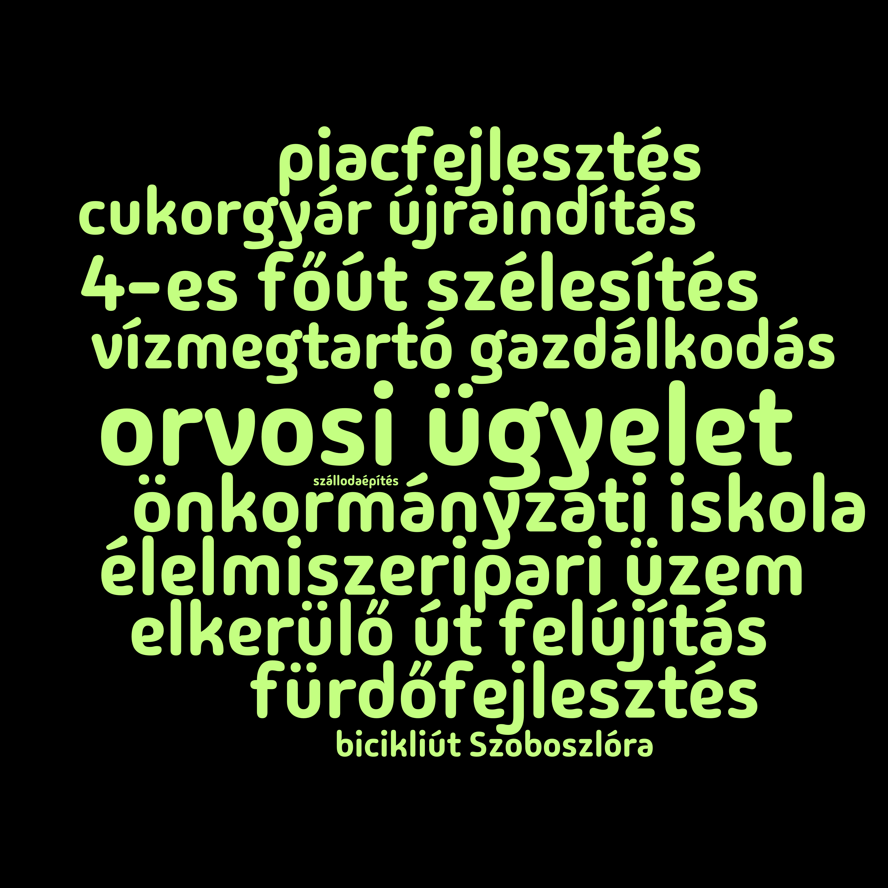

Kabán a helyi Tisza-sziget készített egy felmérést arról, hogy a helyieknek milyen ügyek a legfontosabbak.

A szavazólap az aktivisták által összegyűjtött kérdésekkel:

Az eredmény, Condorcet módszerrel kiértékelve (az egyes ügyek fontossági sorrendje, ahogyan a közösség látta):

* orvosi ügyelet
* élelmiszeripari üzem
* 4-es főút szélesítés
* vízmegtartó gazdálkodás
* önkormányzati iskola
* fürdőfejlesztés
* elkerülő út felújítás
* piacfejlesztés
* cukorgyár újraindítás
* bicikliút Szoboszlóra
* szállodaépítés

Az eredmény mint WordCloud:

